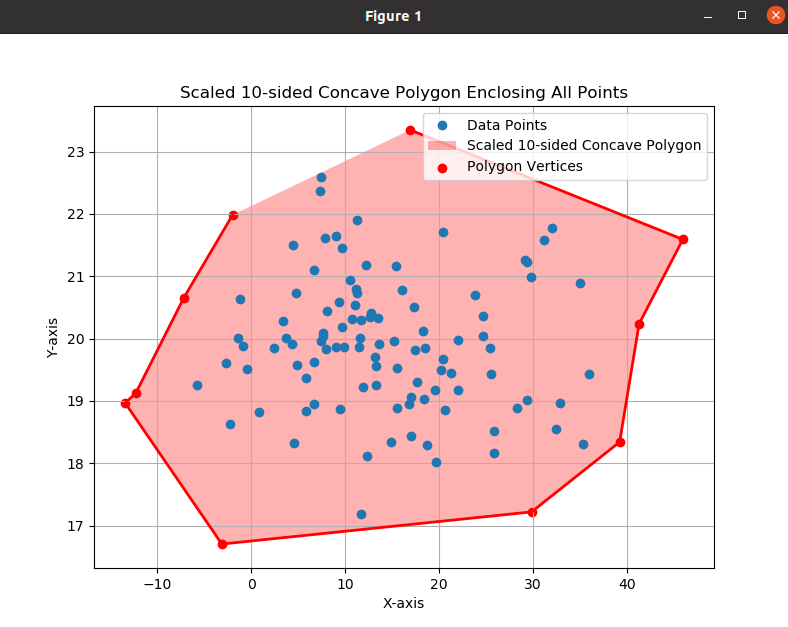

### Forming 10 Sided polygon 
> This Code involves formation of 10 sided polygon using data points provided.
***
### TABLE OF CONTENTS
- [Overview](#Overview)
- [Features](#Features)
- [Requirements](#Requirements)
- [Function Descriptions](#Function-Descriptions)
- [Example](#Example)

### Overview
> Initially this algorithm forms a convex polygon and then try to convert convex hull polygon to 10 sided polygon.
***

### Features
- Forms a convex polygon
- Ensures to form 10 sided polygon
- Ensures all the data points lie inside the convex polygon
***

### Requirements
```bash
import numpy as np
import matplotlib.pyplot as plt
from scipy.spatial import ConvexHull
from matplotlib.path import Path
```
***

### Functions Descriptions
- `reduce_to_polygon(hull_points, num_sides)`<br>
     - hull points are the points formed by convex polygon
     - If number of sides formed by convex polygon is more than 10 then this function reduces number of points selecting only points spaced evenly.

- `interpolate_points(hull_points, num_sides)`<br>
    - If number of sides formed by convex polygon is less than 10 then
    this function add interpolate points at equal spacing between existing points to increse points to 10.

- `scale_polygon(polygon_points, points, scale_factor=0.1)`<br>
    - After decresing number of sides using `reduce_to_polygon(hull_points, num_sides)` if some data points lie outside the polygon then `scale factor` increses size of polygon until all the points of data set lies inside the points.
    - `scale factor` is made variable such that it scales polygon ensuring area is optimised.

- `enforce_concavity(polygon_points, concave_angle=150)`<br>
    - When number of sides are increased then using `interpolate_points(hull_points, num_sides)` this function makes convex angle between two sides to make convex polygon.\

- `ensure_10_sided_polygon(polygon_points, num_sides=10) and all_inside_polygon(polygon, points)`<br>
    - This function ensures the final output contains 10 sides and ensures all the points are present inside the final polygon.

- `main()`<br>
    - Uses convexhull imported uisng SCIPY 
    - Uses the above functions to get final 10 sided poygon.
***

### Example
> ##### INPUT : [Dataset](data.csv) containg points obtained from drone
> ##### OUTPUT : 10 sided polygon 



